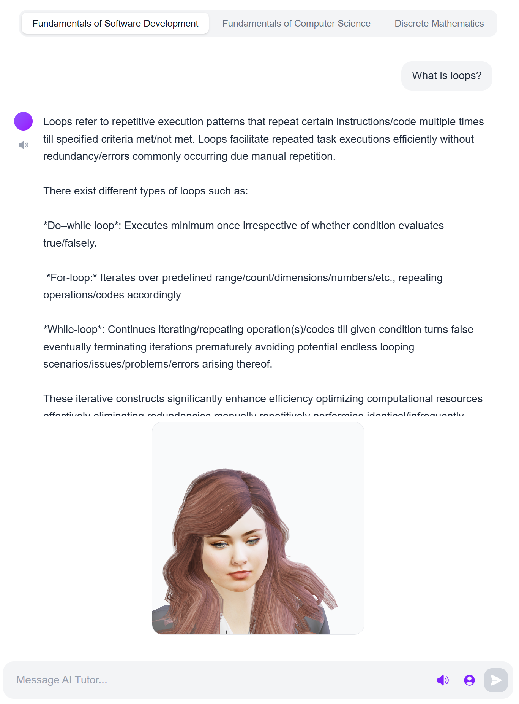
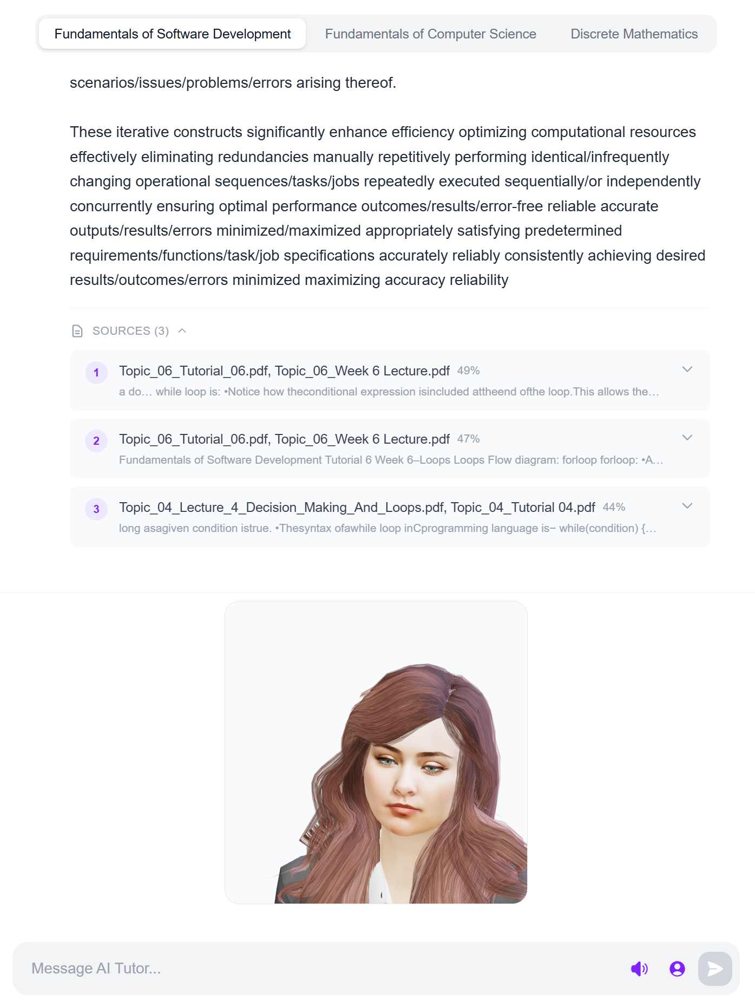
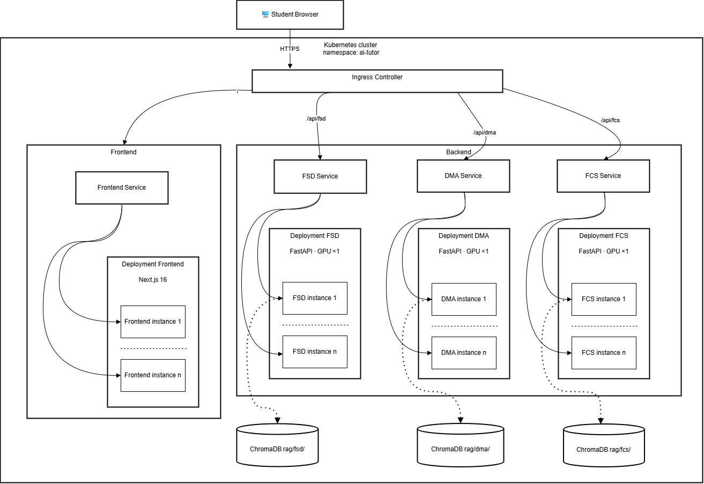
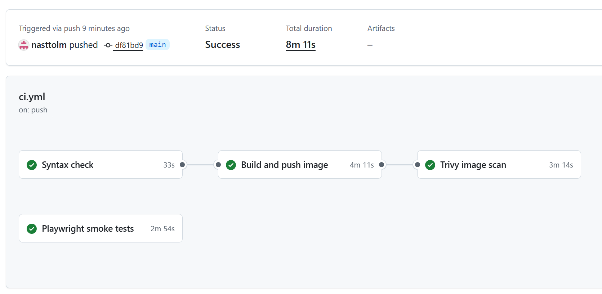
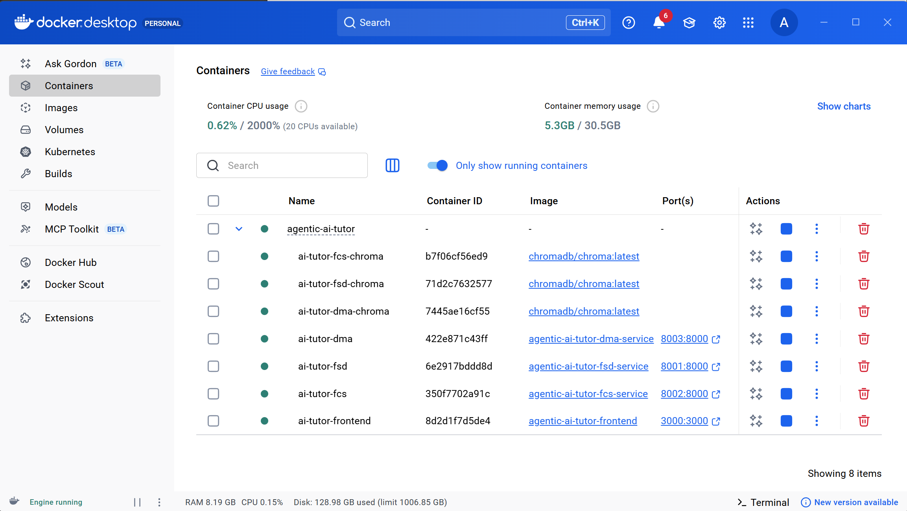
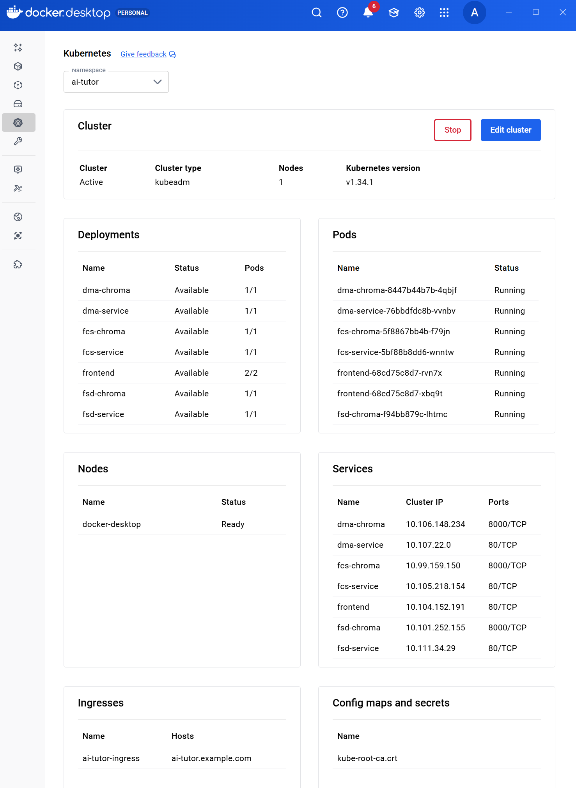
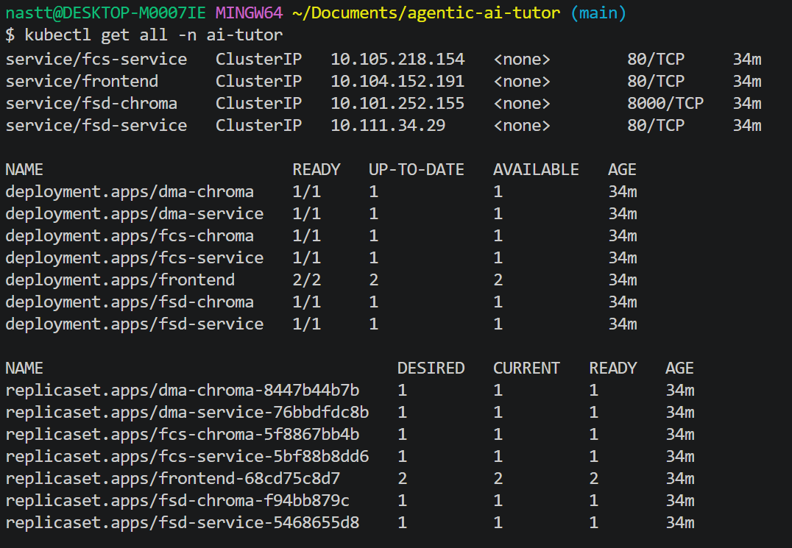
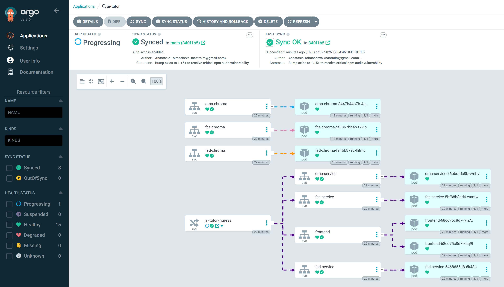

# Scalable Agentic AI Tutor (SLMs + LoRA + RAG + MLOps)

MSc dissertation project - London South Bank University

## Overview

AI Tutor system built from subject-specific Small Language Models (SLMs) for three academic modules:
- **FSD** - Fundamentals of Software Development
- **FCS** - Fundamentals of Computer Science
- **DMA** - Discrete Mathematics

## Technology Stack

### Model & Training

| Component | Technology | Rationale |
|-----------|------------|-----------|
| Base Model | **Phi-4-mini-instruct** (4.2B params) | Best accuracy/efficiency ratio, MIT license, 0.83kg CO2 |
| Fine-tuning | **LoRA** via Unsloth/PEFT | Parameter-efficient, fits 12GB VRAM |
| QA Generation | Phi-3-mini-4k-instruct | Synthetic dataset creation |
| Training Env | Google Colab (Tesla T4) | Free GPU access |

### RAG Pipeline

| Component | Technology |
|-----------|------------|
| Embeddings | sentence-transformers/all-MiniLM-L6-v2 |
| Vector Database | ChromaDB (persistent, per-subject) |
| Chunking | Token-based (1200 tokens, 120 overlap) |

### MLOps & Infrastructure

| Component | Technology |
|-----------|------------|
| Containerisation | **Docker** + Docker Compose |
| Orchestration | **Kubernetes** / EKS |
| CI/CD | **GitHub Actions** + **Argo CD** |

### Application Layer

| Component | Technology |
|-----------|------------|
| Backend API | **FastAPI** (Python) |
| Frontend | **Next.js** + React + TypeScript |
| TTS | **HeadTTS** (browser, primary) + Piper (backend option) |
| Talking-head | **TalkingHead** (browser, primary) + SadTalker (optional video service) |

Frontend preview:




### Evaluation Metrics (Completed)

| Metric | Purpose |
|--------|---------|
| BLEU | N-gram precision |
| ROUGE-L | Sequence overlap |
| METEOR | Semantic similarity |
| BERTScore | Embedding-based similarity |

Results available in `dissertation/chapters/plan.tex` (Model evaluation section).

## Project Structure

```text
agentic-ai-tutor/
|- backend/                         # FastAPI services, inference, RAG
|  |- src/                          # main.py, inference.py, rag.py, schemas.py
|  |- data/                         # adapters, chroma data, runtime assets
|  |- subjects.yaml                 # subject-level config and versions
|  `- requirements.txt
|- frontend/                        # Next.js UI
|  |- app/                          # pages and components
|  |- lib/                          # API client
|  |- scripts/                      # build/runtime helper scripts
|  `- playwright.config.ts
|- k8s/                             # Kubernetes manifests (app + infra)
|  |- argo/                         # Argo CD AppProject/Application
|  `- ...                           # deployments, services, storage, ingress
|- .github/workflows/               # GitHub Actions CI pipeline
|- dissertation/                    # LaTeX source (chapters + figures)
|- notebooks/                       # training/evaluation notebooks
|- tests/                           # project-level tests
|- docker-compose.yml               # monolithic local mode
|- docker-compose.microservices.yml # multi-service local mode
`- README.md
```


## Architecture

### Training Pipeline
Course materials are processed into topic chunks and QA pairs, then used for LoRA adapter training and subject-specific RAG indexing.

Reference architecture diagram:



### CI/CD Pipeline
GitHub Actions builds and validates images, pushes them to GHCR, and Argo CD reconciles Kubernetes state from Git.

Pipeline in practice:



### Deployment (Microservices)
Deployed as isolated subject services (FSD/FCS/DMA), each with its own backend and ChromaDB, plus a shared frontend and ingress routing.

## Quick Start

### Prerequisites
- Docker Desktop (running)
- NVIDIA GPU with CUDA 12.1 (for backend inference)
- 16GB+ RAM, 50GB+ disk

---

### Mode 1 - Microservices (recommended for demo)

Runs all 8 containers (including SadTalker): 3 FastAPI backends, 3 ChromaDB instances, SadTalker, Frontend.

```bash
docker compose -f docker-compose.microservices.yml --profile sadtalker up --build
```

- Frontend: http://localhost:3000
- FSD API: http://localhost:8001/health
- FCS API: http://localhost:8002/health
- DMA API: http://localhost:8003/health
- SadTalker: http://localhost:7860/health

If you do not need SadTalker, run without profile:
```bash
docker compose -f docker-compose.microservices.yml up --build
```

Expected local container layout:



---

### Mode 2 - Monolithic (single backend, all 3 subjects)

```bash
docker compose up --build
```

- Frontend: http://localhost:3000
- Backend: http://localhost:8000/health

---

### Mode 3 - Local development (no Docker, hot reload)

Requires Python venv and ChromaDB installed locally.

```bash
# Terminal 1 - ChromaDB for one subject
chroma run --path ./backend/data/rag/fsd/chroma_store --port 8001

# Terminal 2 - Backend
cd backend
source venv/Scripts/activate   # Windows (Git Bash)
# source venv/bin/activate      # Linux/Mac
SUBJECT=fsd CHROMA_HOST=localhost CHROMA_PORT=8001 \
TTS_ENABLED=true SADTALKER_URL=http://localhost:7860 \
uvicorn src.main:app --reload

# Terminal 3 - Frontend
cd frontend
npm run dev -- --webpack
```

- Frontend: http://localhost:3000
- Backend: http://localhost:8000

---

### Mode 4 - Kubernetes (Minikube)

```bash
minikube start --driver=docker --gpus=all --memory=8192
kubectl apply -k k8s/
kubectl get pods -n ai-tutor
```

See `k8s/` for full manifests.

Kubernetes runtime examples:




---

## Argo CD (GitOps Deployment)

This repository includes Argo CD manifests:
- `k8s/argo/project.yaml`
- `k8s/argo/application.yaml`

`Application` tracks `path: k8s` on `targetRevision: main` and syncs it to namespace `ai-tutor`.

### Local (Docker Desktop Kubernetes)

1. Install Argo CD:
```bash
kubectl create namespace argocd
kubectl apply --server-side -n argocd -f https://raw.githubusercontent.com/argoproj/argo-cd/stable/manifests/install.yaml
```

2. Register project and app:
```bash
kubectl apply -f k8s/argo/project.yaml
kubectl apply -f k8s/argo/application.yaml
```

3. Open Argo CD UI:
```bash
kubectl -n argocd port-forward svc/argocd-server 8080:443
```
Open: `https://localhost:8080`

4. Get initial admin password:
```bash
kubectl -n argocd get secret argocd-initial-admin-secret -o jsonpath="{.data.password}" | base64 -d
```
Username: `admin`

Argo CD application view:



Note for local Docker Desktop:
- `Ingress` may remain `Progressing` because AWS ALB annotations in `k8s/ingress.yaml` are cloud-specific.
- Core services and pods can still be healthy and running.

### Cloud (EKS) recommended flow

1. Create EKS cluster and install:
- Argo CD
- AWS Load Balancer Controller (for ALB Ingress)
- NVIDIA device plugin (if GPU nodes are used)

2. Ensure manifests use cloud-appropriate settings:
- Ingress annotations for ALB
- StorageClass values available in EKS (for example `gp3`)

3. Apply Argo resources:
```bash
kubectl apply -f k8s/argo/project.yaml
kubectl apply -f k8s/argo/application.yaml
```

4. GitOps runtime behavior:
- Push to `main` updates manifests/images in Git.
- Argo CD detects commit and syncs cluster state automatically (`prune` + `selfHeal` enabled).

---

## Author

**Anastasia Tolmacheva**

Supervisor: Brahim El Boudani

London South Bank University, 2026

